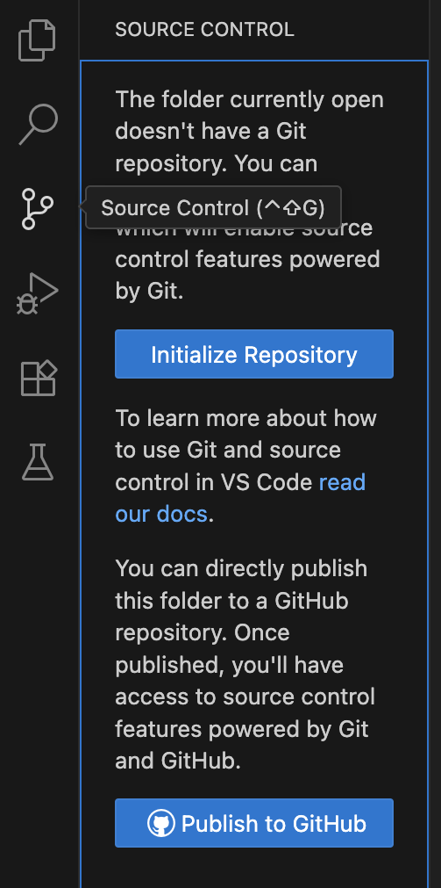

# Контрольная точка 1-2

> личные данные не хочу постить в публичный доступ айм сори

---
### Как я создала мой первый репозиторий:

1. сделала аккаунт / залогинилась на гитхабе
после зашла в вскод и там тоже залогинилась на гитхаб аккаунт 

2. потом создала файлик .тхт, там что то накидала и в вскоде нажала волшебную третью кнопочку слева, 
после чего мне выдало 2 кнопочки: initialize repository и publish to github



3. я выбрала publish и мне выдало 2 опции: создать приватный или публичный репозиторий с 
именем папки

4. выбираю публичный, потом выбираю файлы которые хочу и оно автоматически делает коммит

### git clone и кого же мы вообще клонируем?

> Команда ```git clone``` создает локальную копию существующего репозитория Git, скачивая все файлы, папки и всю историю его коммитов. Это позволяет работать с проектом локально, независимо от удаленного репозитория.

есть несколько способов использовать эту команду:

1. ```git clone [url]```
	- самая базовая конфигурация, клонирует репозиторий, указанный в ссылке локально
	
2. ```git clone --single-branch```
	- клонирует лишь конкретную ветку

3. ```git clone --mirror```
	- клонирует репозиторий без возможности редактирования

### Что такое commit и с чем его едят?

> Коммит (от англ. commit — «фиксировать») — это снимок (снапшот) состояния проекта в определенный момент времени в системах контроля версий. 
 
стоит начать с того, что коммит производится в три этапа: 
 
1. ```git add имя_файла.расширение``` или же ```git add .```
	- отличаются они тем, что первый добавляет в снапшот лишь один выбранный вами файл, а git add . добавляет сразу все измененные файлы из директории
	- чтобы проверить, какие файлы добавились вторым способом, можно прописать команду git status
	 
2. ```git commit -m "комментарий"``` или же просто ```git commit```
	- как я поняла комментарии обязательны, вторым способом не очень поняла как заливать, тк не получилось, поэтому использую первый
	- он и является снапшотом, который фиксирует изменения в репозитории, но эта команда хранит его локально

3. ```git push```
	- отправляет коммит на удаленный репозиторий из локального